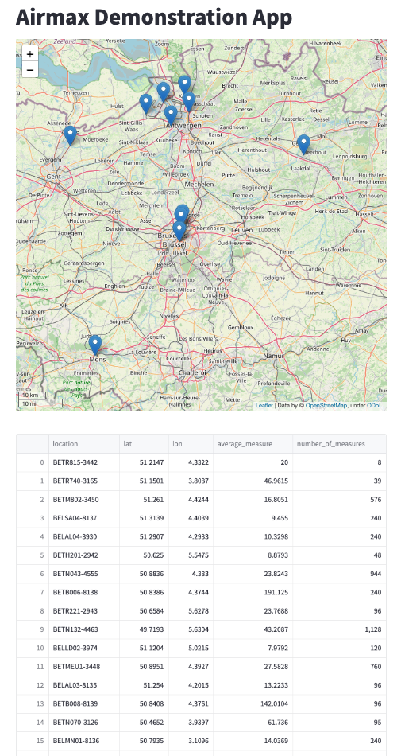

# Airmax demonstration app

This application displays realtime data from a postgres database table as described in https://github.com/wietsche/AirMax

## Instructions

1. Deploy this repo as an app on https://streamlit.io/cloud
2. Configure database connection details as secrets in TOML format:
```toml
[postgres]
host = "xxx"
port = 5432
database = "xxx"
user = "xxx"
password = "xxx"
```
3. Run it!


